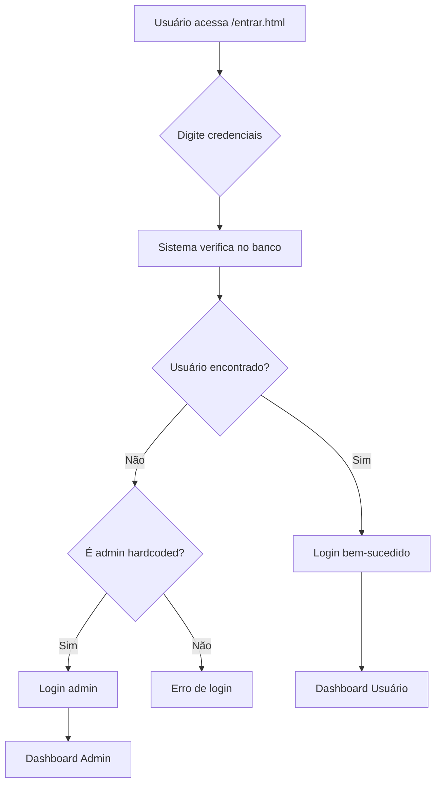

# 🧮 MathKids - Matemática Mágica para Crianças

Uma plataforma educativa digital para ensinar **matemática básica** para crianças de **3 a 9 anos** de forma interativa. O aprendizado é acompanhado por um dragão mascote que transforma cada lição em uma aventura mágica!


---

## 🛠️ Tecnologias Utilizadas

### **Frontend:**
- **HTML5** + **CSS3** - Interface responsiva e acessível
- **JavaScript** - Interatividade e validações
- **Design Mobile-First** - Otimizado para tablets e smartphones

### **Backend:**
- **Node.js** + **Express.js** - Servidor web robusto
- **PostgreSQL** - Banco de dados relacional
- **bcrypt** - Criptografia de senhas (10 rounds)
- **CORS** - Configuração de segurança

### **Documentação:**
- **Swagger/OpenAPI 3.0.3** - Documentação interativa da API
- **swagger-ui-express** - Interface visual personalizada

### **Deploy & DevOps:**
- **Render** - Hospedagem em nuvem
- **Neon.tech** - PostgreSQL em nuvem
- **GitHub Actions** - Deploy automático

---

## 🎯 Sobre o Projeto e Metodologia

O **MathKids** visa tornar a matemática uma experiência **divertida e envolvente** através de:

* **🐉 Mascote Amigável:** Um dragão fofo que guia a criança e oferece **reforço positivo** contínuo.
* **🎨 Interface Lúdica:** Design responsivo, colorido e intuitivo, ideal para o **público infantil** (3-9 anos).
* **🎮 Gamificação:** Conceitos matemáticos transformados em jogos interativos com um sistema de **progressão por idade e habilidade** (em desenvolvimento).
* **🧠 Aprendizado Progressivo:** A dificuldade das atividades cresce conforme a idade da criança.

---

## ✨ Status e Funcionalidades Implementadas

O projeto avançou significativamente! O **sistema completo de autenticação** está implementado e funcional.

### ✅ Módulos Concluídos

#### 🔐 **Sistema de Autenticação Completo**
| Funcionalidade | Descrição | Status |
| :--- | :--- | :---: |
| **Cadastro de Usuários** | Registro de pais/responsáveis com validação | ✅ |
| **Login Duplo** | Admin (hardcoded) + Usuários do banco | ✅ |
| **Dashboards** | Painel administrativo e painel de usuário | ✅ |
| **Sessão Segura** | localStorage/sessionStorage com verificação | ✅ |
| **API de Login** | Endpoint `/api/login` com bcrypt | ✅ |

#### 🎨 **Interface Responsiva**
| Funcionalidade | Descrição | Status |
| :--- | :--- | :---: |
| **Design Mobile-First** | Layout responsivo para todas as telas | ✅ |
| **Tema Infantil** | Cores e design apropriado para crianças | ✅ |
| **Navegação Intuitiva** | Menu e navegação simples | ✅ |

#### 🔧 **Backend Robusto**
| Funcionalidade | Descrição | Status |
| :--- | :--- | :---: |
| **API REST** | Endpoints para cadastro e login | ✅ |
| **Criptografia** | Senhas com bcrypt (10 rounds) | ✅ |
| **Banco PostgreSQL** | Persistência de dados segura | ✅ |
| **Documentação Swagger** | API documentada interativamente | ✅ |

### 🔄 Módulos Em Desenvolvimento

| Módulo | Escopo | Prioridade |
| :--- | :--- | :---: |
| **Educação** | Atividades de **contagem** (3-5 anos) | 🔶 Média |
| **Operações** | **Soma e subtração** (5-7 anos) | 🔶 Média |
| **Progresso** | Sistema de **níveis e gamificação** | 🔷 Baixa |

### ✅ Credenciais de Teste

#### 👤 **Admin (Acesso Total)**
- **Email:** `adm@email.com`
- **Senha:** `123456`
- **Dashboard:** Painel administrativo com informações de sessão

#### 👥 **Usuários Cadastrados**
- Qualquer usuário registrado via `/cadastro/cadastrar.html`
- **Dashboard:** Painel de usuário personalizado

---

## 🎯 Roadmap de Desenvolvimento

| Fase | Foco | Status |
| :--- | :--- | :--- |
| **Fase 1** | Autenticação e Interface Base | ✅ **Concluída** |
| **Fase 1.5** | Sistema de Login Completo | ✅ **Concluída** |
| **Fase 2** | Primeiros Módulos Educativos | 🔄 Em Desenvolvimento |
| **Fase 3** | Gamificação e Recompensas | 📅 Planejado (Q2 2026) |
| **Fase 4** | Relatórios de Progresso para Pais | 📅 Planejado (Q3 2026) |

---

## 🚀 Como Executar o Sistema Completo

### 📋 Pré-requisitos

* [**Node.js**](https://nodejs.org/) v18+
* **PostgreSQL** (configurado e acessível)
* Navegador web moderno

### 🔧 Instalação e Configuração

1.  **Clone o repositório:**
    ```bash
    git clone https://github.com/abe-karin/mathkids.git
    cd mathkids
    ```
2.  **Configure o Backend:**
    ```bash
    cd backend-registro
    npm install
    # Configure o arquivo .env com:
    # PORT=5000
    # DATABASE_URL=sua_conexao_postgresql
    ```
3.  **Inicie os Servidores:**

    **Terminal 1 - Backend:**
    ```bash
    cd backend-registro
    npm start # API rodando em http://localhost:5000
    ```

    **Terminal 2 - Frontend (na raiz do projeto):**
    ```bash
    python -m http.server 8080 # Aplicativo acessível em http://localhost:8080
    ```

### 🎮 Como Testar o Sistema

#### 1. **Teste de Cadastro:**
1. Acesse: `http://localhost:8080/cadastro/cadastrar.html`
2. Preencha o formulário com dados válidos
3. Clique em "Cadastrar"

#### 2. **Teste de Login (Admin):**
1. Acesse: `http://localhost:8080/cadastro/entrar.html`
2. Use: `adm@email.com` / `123456`
3. Será redirecionado para o dashboard administrativo

#### 3. **Teste de Login (Usuário):**
1. Acesse: `http://localhost:8080/cadastro/entrar.html`
2. Use credenciais de um usuário cadastrado
3. Será redirecionado para o dashboard de usuário

### 🌐 Navegação

#### **🚀 Produção (Render):**
- **Swagger UI:** https://mathkids-back.onrender.com/api-docs
- **API Principal:** https://mathkids-back.onrender.com/
- **Health Check:** https://mathkids-back.onrender.com/health
- **Debug Info:** https://mathkids-back.onrender.com/debug

#### **🏠 Desenvolvimento Local:**
- **Frontend:** http://localhost:5000/
- **Swagger UI:** http://localhost:5000/api-docs
- **Cadastro:** http://localhost:5000/cadastro
- **API JSON:** http://localhost:5000/api-docs.json

---

## 📁 Estrutura Completa do Projeto

```
mathkids/
├── � index.html                    # 🏠 Landing page principal
├── 📄 admin-dashboard.html          # 🔑 Dashboard administrativo
├── 📄 dashboard.html                # 👤 Dashboard de usuário
├── 📄 package-lock.json             # 📦 Lock file do npm (raiz)
├── 📄 README.md                     # 📚 Este arquivo de documentação
│
├── 📁 assets/                       # 🎨 Recursos do Frontend
│   ├── 📁 css/                      # 🎨 Estilos CSS
│   │   ├── cadastro.css             # Estilo da página de cadastro
│   │   ├── entrar.css               # Estilo da página de login
│   │   ├── home.css                 # Estilo da página inicial
│   │   └── shared.css               # Estilos compartilhados
│   ├── 📁 images/                   # 🖼️ Imagens e recursos visuais
│   │   └── dragao.png               # 🐉 Mascote dragão
│   └── 📁 js/                       # ⚡ Scripts JavaScript
│       ├── app.js                   # Script principal da aplicação
│       ├── login.js                 # 🔐 Sistema completo de login
│       ├── navigation.js            # 🧭 Navegação entre páginas
│       └── registration.js          # 📝 Sistema de cadastro
│
├── 📁 backend-registro/             # 🖥️ Servidor Node.js e API
│   ├── 📄 .env                      # 🔒 Variáveis de ambiente (privado)
│   ├── 📄 .env.example              # 📝 Template de configuração
│   ├── 📄 .gitignore                # 🚫 Arquivos ignorados pelo Git
│   ├── 📄 package.json              # 📦 Dependências do backend
│   ├── 📄 package-lock.json         # 📦 Lock file do npm
│   ├── 📄 server.js                 # 🔧 Servidor principal da API
│   ├── 📄 swagger.json              # 📋 Documentação OpenAPI (JSON)
│   ├── 📄 swagger.yaml              # 📋 Documentação OpenAPI (YAML)
│   └── 📁 node_modules/             # 📚 Dependências instaladas
│
└── 📁 cadastro/                     # 🔐 Páginas de Autenticação
    ├── cadastrar.html               # 📝 Página de registro
    └── entrar.html                  # 🚪 Página de login
```

### 🔍 Detalhamento dos Componentes

#### 🎨 **Frontend (assets/)**
- **CSS:** Estilização responsiva com tema infantil
- **JavaScript:** Lógica de autenticação, navegação e validações
- **Imagens:** Recursos visuais incluindo o dragão mascote

#### 🖥️ **Backend (backend-registro/)**
- **server.js:** API REST com endpoints de cadastro e login
- **swagger.json/yaml:** Documentação interativa da API
- **Configuração:** Arquivos de ambiente e dependências

#### 🔐 **Autenticação (cadastro/)**
- **cadastrar.html:** Interface de registro de novos usuários
- **entrar.html:** Interface de login integrada com sistema duplo

#### 📊 **Dashboards**
- **admin-dashboard.html:** Painel administrativo com privilégios especiais
- **dashboard.html:** Painel de usuário padrão
---

# 📚 Documentação da API - Swagger

## 🌐 **Acesso ao Swagger (Produção)**

A documentação interativa da API está disponível em produção:

### **🚀 URLs Principais:**
- **Swagger UI:** https://mathkids-back.onrender.com/api-docs
- **API JSON:** https://mathkids-back.onrender.com/api-docs.json
- **Página Principal:** https://mathkids-back.onrender.com/ (redireciona para Swagger)
- **Health Check:** https://mathkids-back.onrender.com/health

## 🔧 **Configuração Inteligente**

O Swagger foi configurado para funcionar automaticamente em qualquer ambiente:

### **🏠 Desenvolvimento Local:**
```bash
cd backend-registro
npm start
```
- **Swagger UI:** http://localhost:5000/api-docs
- **Frontend:** http://localhost:5000/
- **API JSON:** http://localhost:5000/api-docs.json

### **🌐 Produção (Render):**
- Detecta automaticamente o ambiente de produção
- URLs se ajustam para `https://mathkids-back.onrender.com`
- Página inicial redireciona automaticamente para o Swagger

## 📋 **Endpoints Implementados**

### **🔐 Autenticação**
| Método | Endpoint | Descrição | Status |
|--------|----------|-----------|--------|
| `POST` | `/api/register` | Registro de responsáveis/pais | ✅ |
| `POST` | `/api/login` | Login de usuários e admin | ✅ |

### **🏥 Sistema**
| Método | Endpoint | Descrição | Status |
|--------|----------|-----------|--------|
| `GET` | `/health` | Status básico do servidor | ✅ |
| `GET` | `/health/database` | Conectividade com PostgreSQL | ✅ |
| `GET` | `/debug` | Informações de diagnóstico | ✅ |

### **📄 Páginas**
| Método | Endpoint | Descrição | Status |
|--------|----------|-----------|--------|
| `GET` | `/` | Página principal (redireciona para Swagger) | ✅ |
| `GET` | `/cadastro` | Página de cadastro | ✅ |
| `GET` | `/docs` | Atalho para documentação | ✅ |

## 🧪 **Como Testar a API**

### **1. 🌐 Swagger UI (Recomendado)**
1. Acesse: https://mathkids-back.onrender.com/api-docs
2. Clique em qualquer endpoint
3. Use **"Try it out"** para testar interativamente
4. Veja exemplos e schemas automáticos

### **2. 📝 Exemplo de Registro Válido:**
```json
{
  "nomeDoResponsavel": "Maria Silva Santos",
  "email": "maria.test@email.com",
  "senha": "minhasenha123",
  "dataDeNascimento": "1985-03-15",
  "termosAceitos": true
}
```

### **3. � Exemplo de Login:**
```json
{
  "email": "adm@email.com",
  "senha": "123456"
}
```

### **4. �🔧 curl (Terminal):**
```bash
# Testar login de admin
curl -X POST https://mathkids-back.onrender.com/api/login \
  -H "Content-Type: application/json" \
  -d '{
    "email": "adm@email.com",
    "senha": "123456"
  }'

# Testar registro de usuário
curl -X POST https://mathkids-back.onrender.com/api/register \
  -H "Content-Type: application/json" \
  -d '{
    "nomeDoResponsavel": "Teste Usuario",
    "email": "teste@mathkids.com",
    "senha": "senha123",
    "dataDeNascimento": "1990-01-01",
    "termosAceitos": true
  }'

# Testar health check
curl https://mathkids-back.onrender.com/health
```

### **5. 📱 Postman/Insomnia:**
- Importe: https://mathkids-back.onrender.com/api-docs.json
- Base URL: `https://mathkids-back.onrender.com`

## 🎨 **Recursos do Swagger Personalizado**

### **✨ Design MathKids:**
- 🎨 Cores personalizadas (verde #64C9A6)
- 🐉 Favicon com dragão mascote
- 📱 Interface responsiva
- 🏷️ Organização por tags

### **🔧 Funcionalidades:**
- ✅ **Try it out** habilitado em todos os endpoints
- ✅ **Exemplos práticos** para requests/responses
- ✅ **Schemas detalhados** com validações
- ✅ **Múltiplos servidores** (desenvolvimento/produção)
- ✅ **Códigos de erro** documentados com exemplos

## 🚨 **Códigos de Resposta**

| Código | Status | Descrição | Endpoint |
|--------|--------|-----------|----------|
| `200` | ✅ OK | Login bem-sucedido | `/api/login` |
| `201` | ✅ Created | Usuário criado com sucesso | `/api/register` |
| `400` | ❌ Bad Request | Dados inválidos ou campos faltando | `/api/*` |
| `401` | ❌ Unauthorized | Credenciais inválidas | `/api/login` |
| `409` | ❌ Conflict | Email já existe no sistema | `/api/register` |
| `500` | ❌ Server Error | Erro interno do servidor | Qualquer endpoint |

## 🔍 **Validações Implementadas**

### **📋 Registro (`/api/register`):**
- ✅ `nomeDoResponsavel` (2-255 caracteres, apenas letras)
- ✅ `email` (formato válido, único no sistema)
- ✅ `senha` (mínimo 6 caracteres)
- ✅ `dataDeNascimento` (formato YYYY-MM-DD)
- ✅ `termosAceitos` (deve ser `true`)

### **📋 Login (`/api/login`):**
- ✅ `email` (formato válido)
- ✅ `senha` (mínimo 6 caracteres)
- ✅ Verificação no banco de dados
- ✅ Admin hardcoded como fallback

### **🔒 Segurança:**
- ✅ Senhas criptografadas com bcrypt (10 rounds)
- ✅ Validação de email único
- ✅ Sanitização de dados de entrada
- ✅ CORS configurado para segurança

## 🛠️ **Troubleshooting**

### **❌ Erro: "Swagger não carrega"**
**Solução:**
1. Verificar se servidor está online: https://mathkids-back.onrender.com/health
2. Aguardar alguns minutos (cold start do Render)
3. Verificar logs no dashboard do Render

### **❌ Erro: "Login não funciona"**
**Solução:**
1. Verificar se endpoint `/api/login` responde
2. Testar com credenciais admin: `adm@email.com` / `123456`
3. Verificar console do navegador para erros de CORS

### **❌ Erro: "Database connection failed"**
**Solução:**
1. Verificar: https://mathkids-back.onrender.com/health/database
2. Configurar DATABASE_URL no Render
3. Verificar logs de conexão

## 📞 **Debug e Monitoramento**

### **🔍 Endpoints de Debug:**
```bash
# Informações do servidor
GET https://mathkids-back.onrender.com/debug

# Status da API
GET https://mathkids-back.onrender.com/api/status

# Health check básico
GET https://mathkids-back.onrender.com/health

# Health check do banco
GET https://mathkids-back.onrender.com/health/database
```

### **📊 Monitoramento:**
- Status do servidor: Sempre disponível via `/health`
- Conectividade DB: Verificação via `/health/database`
- Informações técnicas: Disponível via `/debug`
- Logs detalhados: Disponível no dashboard do Render

---

**💡 Dica:** Use o Swagger UI em produção para uma experiência completa de teste da API MathKids com interface visual personalizada!

---

## 🔐 Sistema de Login Implementado

### **🎯 Funcionalidades do Sistema de Autenticação**

O MathKids possui um **sistema de login duplo** completamente funcional:

#### **👑 Acesso Administrativo**
- **Email:** `adm@email.com`
- **Senha:** `123456`
- **Privilégios:** Acesso total ao sistema
- **Dashboard:** Painel administrativo com informações detalhadas

#### **👥 Acesso de Usuários**
- **Cadastro:** Via `/cadastro/cadastrar.html`
- **Login:** Usuários registrados no banco PostgreSQL
- **Dashboard:** Painel personalizado para cada usuário

### **🔄 Fluxo de Autenticação**



### **🛡️ Segurança Implementada**

| Recurso | Descrição | Status |
|---------|-----------|--------|
| **Criptografia bcrypt** | Senhas com 10 rounds de salt | ✅ |
| **Sessão Segura** | localStorage + sessionStorage | ✅ |
| **Validação de Email** | Formato e unicidade | ✅ |
| **Sanitização** | Proteção contra XSS | ✅ |
| **CORS** | Configuração para produção | ✅ |

### **📱 Arquivos do Sistema de Login**

```
Sistema de Autenticação/
├── 📄 /cadastro/entrar.html          # Interface de login
├── 📄 /cadastro/cadastrar.html       # Interface de cadastro
├── 📄 /assets/js/login.js            # Lógica completa de autenticação
├── 📄 /assets/js/registration.js     # Sistema de cadastro
├── 📄 /admin-dashboard.html          # Dashboard administrativo
├── 📄 /dashboard.html                # Dashboard de usuário
└── 📄 /backend-registro/server.js    # API de autenticação
```

### **🧪 Como Testar o Sistema de Login**

#### **1. Teste do Admin:**
```bash
# Via frontend
1. Acesse: http://localhost:8080/cadastro/entrar.html
2. Email: adm@email.com
3. Senha: 123456
4. Resultado: Redirecionamento para admin-dashboard.html

# Via API
curl -X POST http://localhost:5000/api/login \
  -H "Content-Type: application/json" \
  -d '{"email": "adm@email.com", "senha": "123456"}'
```

#### **2. Teste de Usuário:**
```bash
# 1. Primeiro, cadastre um usuário
1. Acesse: http://localhost:8080/cadastro/cadastrar.html
2. Preencha o formulário
3. Confirme o cadastro

# 2. Faça login
1. Acesse: http://localhost:8080/cadastro/entrar.html
2. Use as credenciais cadastradas
3. Resultado: Redirecionamento para dashboard.html
```

### **📊 Recursos dos Dashboards**

#### **🔑 Admin Dashboard (`admin-dashboard.html`)**
- ✅ Verificação de privilégios administrativos
- ✅ Exibição de informações de sessão
- ✅ Informações do usuário logado
- ✅ Opção de logout seguro

#### **👤 User Dashboard (`dashboard.html`)**
- ✅ Informações personalizadas do usuário
- ✅ Detecção de admin (com oferta de redirecionamento)
- ✅ Gerenciamento de sessão
- ✅ Interface amigável e responsiva

### **🔧 Configuração de Desenvolvimento**

Para configurar o sistema de login em desenvolvimento:

```bash
# 1. Configure o backend
cd backend-registro
npm install
cp .env.example .env
# Configure DATABASE_URL no .env

# 2. Inicie o servidor
npm start  # Roda na porta 5000

# 3. Inicie o frontend (nova aba do terminal)
cd ..
python -m http.server 8080  # Roda na porta 8080
```

### **🌐 URLs de Teste**

#### **🏠 Desenvolvimento Local:**
- **Login:** http://localhost:8080/cadastro/entrar.html
- **Cadastro:** http://localhost:8080/cadastro/cadastrar.html
- **Admin Dashboard:** http://localhost:8080/admin-dashboard.html
- **User Dashboard:** http://localhost:8080/dashboard.html
- **API Login:** http://localhost:5000/api/login

#### **🚀 Produção (Render):**
- **API Login:** https://mathkids-back.onrender.com/api/login
- **Swagger:** https://mathkids-back.onrender.com/api-docs

**💡 Próximos passos:** Com o sistema de autenticação completo, o foco agora será a implementação dos módulos educativos de matemática para crianças de 3-9 anos.

---

## 🤝 Contribuição

Este é um projeto **open-source** com foco educativo. Contribuições são muito bem-vindas em qualquer área (código, design, pedagogia, traduções).

1.  Faça um **fork** do repositório.
2.  Crie uma branch para sua funcionalidade.
3.  Abra um **Pull Request**.

---

## 📞 Contato e Licença

Para dúvidas, sugestões ou colaborações, por favor, **abra uma issue** no repositório.

Este projeto está sob a **Licença ISC**. Veja o arquivo `LICENSE` para mais detalhes.

**🎓 Construindo o futuro da educação matemática, uma linha de código por vez! 🐉✨**

